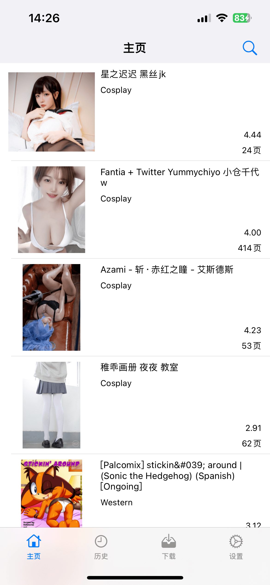
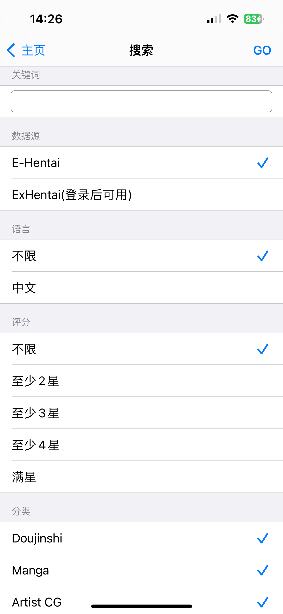
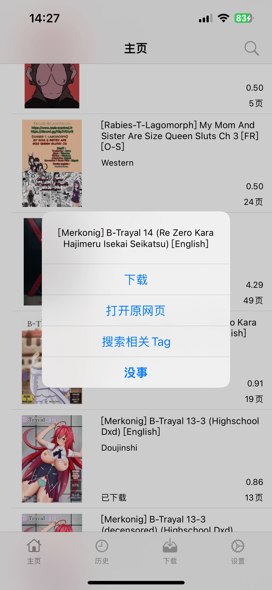
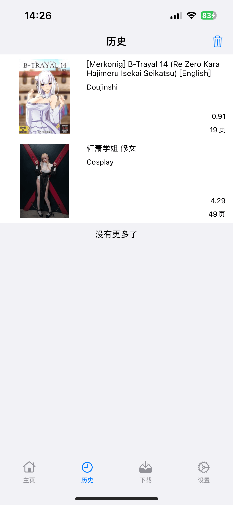
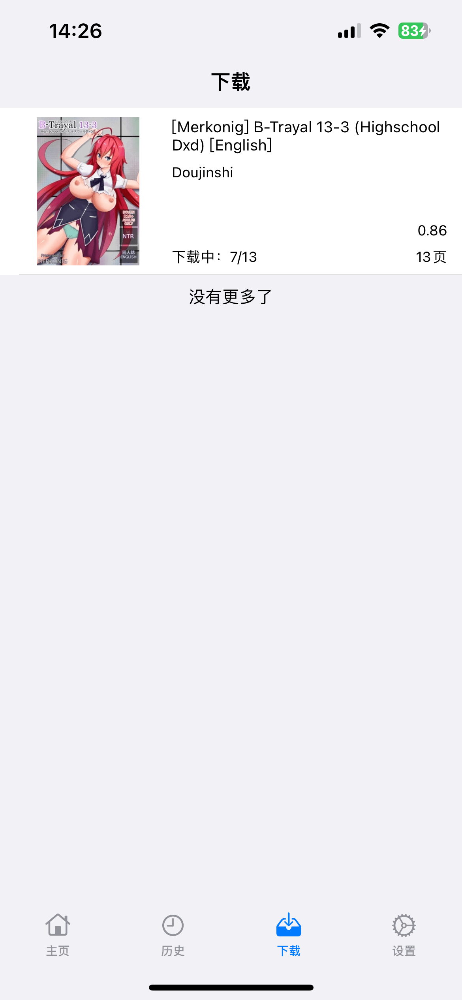
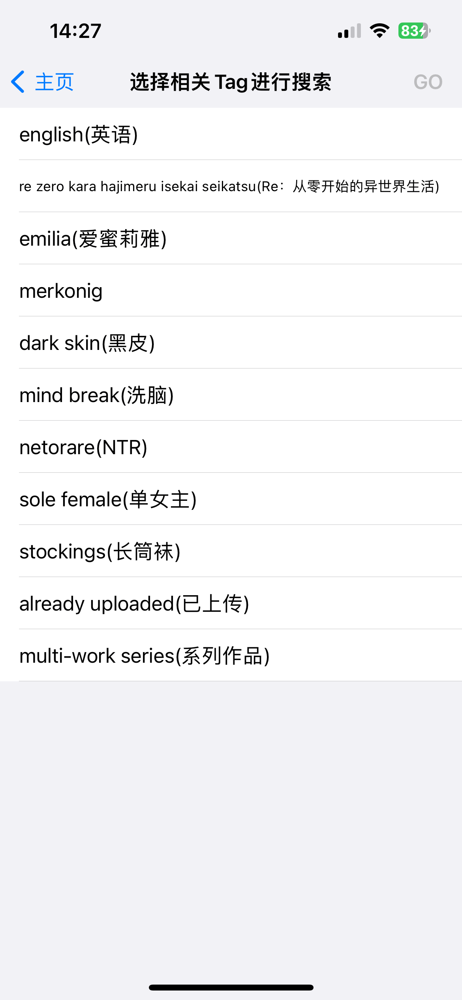
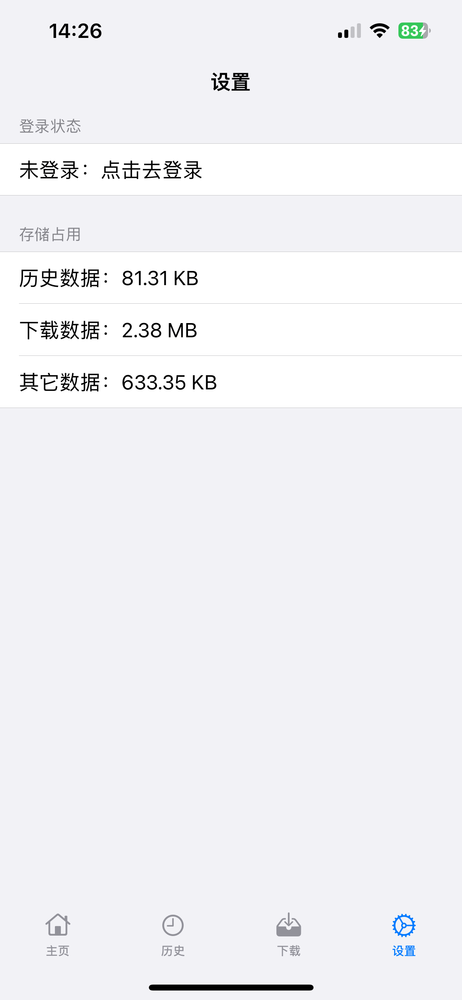
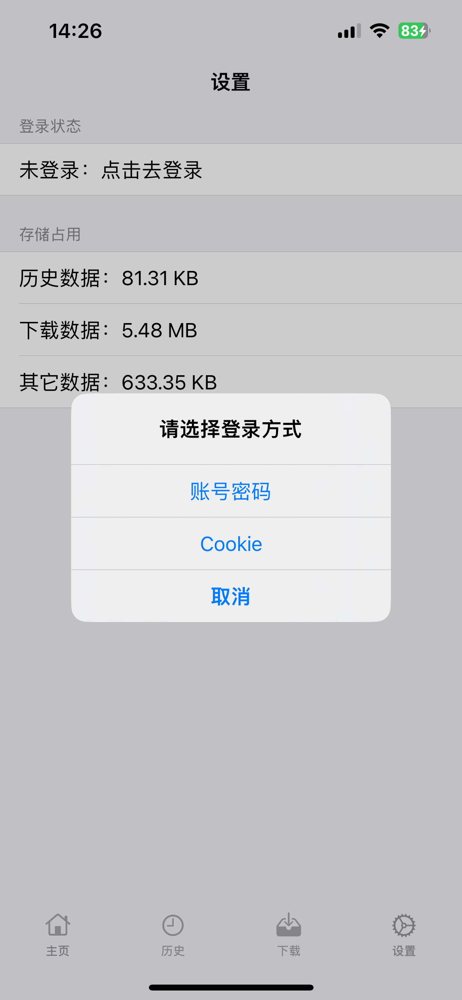
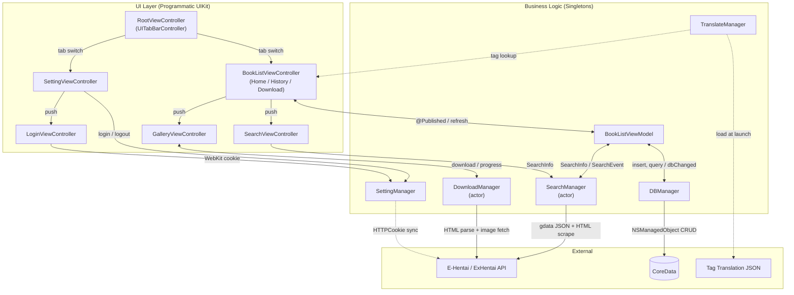

<p align="center">
  
</p>

<h1 align="center">EMHenTai</h1>

<p align="center"><strong>A lightweight, pure-Swift E-Hentai client for iOS.</strong></p>

<p align="center">
  <a href="https://github.com/yuman07/EMHentai/stargazers"></a>
  <a href="LICENSE"></a>
  <br>
  
  
  
</p>

<p align="center">
  <a href="README.md">English</a> | <a href="README_ZH.md">中文</a>
</p>

---

## What is EMHenTai?

EMHenTai is a third-party iOS client for [E-Hentai](https://e-hentai.org/), one of the largest online gallery communities. Built entirely in Swift with zero Objective-C code, it provides a native mobile experience for browsing, searching, and downloading galleries on iPhone and iPad.

The app requires no backend server — it communicates directly with E-Hentai's web API, parsing HTML and JSON responses to deliver a fast, offline-capable reading experience.

## Features

- **E-Hentai & ExHentai** — Switch between sources seamlessly; ExHentai unlocks after login
- **Advanced Search** — Filter by keyword, language, rating, and 10 content categories
- **Gallery Viewer** — Horizontal page-by-page reader with page jump and reading progress memory
- **Download Manager** — Background downloading with pause, resume, and delete support
- **Browsing History** — Automatic history tracking with bulk clear
- **Tag Search** — Browse and search by related tags from any gallery
- **Tag Translation** — Bilingual tag display (English + Chinese) powered by EhTagTranslation
- **Content Filtering** — Toggle filters for AI-generated and gore content
- **Dual Login** — Sign in via account/password (WebKit) or direct cookie injection
- **Storage Management** — View disk usage by category and clear cached data
- **Universal** — iPhone & iPad, portrait & landscape, dark mode, Chinese & English

## Screenshots

<p align="center">
  
  
  
</p>

<p align="center">
  
  
  
</p>

<p align="center">
  
  
</p>

## Install

> No pre-built IPA is provided due to legal considerations around E-Hentai content. You must build from source using Xcode.

### iOS (17.0+, arm64)

#### Prerequisites

- A Mac with [Xcode](https://apps.apple.com/app/xcode/id497799835) installed (free from the Mac App Store)
- An Apple ID (free; needed for code signing)
- An iPhone or iPad running iOS 17.0 or later

#### Steps

1. Clone the repository and open the project:
   ```bash
   git clone https://github.com/yuman07/EMHentai.git
   cd EMHentai
   open EMHenTai.xcodeproj
   ```
2. In Xcode, select the **EMHenTai** target, go to **Signing & Capabilities**, and choose your Apple ID team.
3. Connect your device via USB (or Wi-Fi) and select it as the run destination.
4. Press **Cmd+R** to build and install. No paid developer account is needed.

#### Trust the Developer Certificate

Since the app is sideloaded rather than installed from the App Store, you must trust the developer certificate on your device before the first launch:

1. On your device, open **Settings > General > VPN & Device Management**.
2. Tap your developer account under "Developer App".
3. Tap **Trust** and confirm.

> **Note:** Free Apple ID provisioning profiles expire after 7 days, requiring you to reconnect and rebuild. A paid Apple Developer account ($99/year) extends this to one year.

## Usage

- **ExHentai access** — ExHentai requires login. Go to the **Settings** tab, tap the login status row, and sign in via account/password or cookie.
- **Long press a gallery** — Opens a context menu with options to download, open the original webpage, or search related tags.
- **Page jump** — In the gallery viewer, tap the jump icon in the top-right corner to go to a specific page number.
- **Select/deselect all categories** — On the search screen, double-tap the **Category** section header to toggle all categories at once.
- **Content filters** — The **Settings** tab provides toggles to hide AI-generated and gore content from search results.

## Development

> Development is only supported on macOS.

#### Prerequisites

- macOS 26.2+ (Tahoe)
- [Xcode 26.4+](https://apps.apple.com/app/xcode/id497799835) (free from the Mac App Store)

#### Build

```bash
# Clone the repository
git clone https://github.com/yuman07/EMHentai.git

# Navigate to the project directory
cd EMHentai

# Open the Xcode project
# SPM dependencies (Alamofire, Kingfisher) resolve automatically on first open
open EMHenTai.xcodeproj

# Build and run on a simulator via Xcode (Cmd+R), or from the command line:
xcodebuild -project EMHenTai.xcodeproj -scheme EMHenTai \
  -destination 'platform=iOS Simulator,name=iPhone 16' build
```

## Technical Overview

EMHenTai follows an **MVVM architecture** with a layer of **singleton managers** handling core business logic. The UI is built entirely in **programmatic UIKit** — no storyboards or XIBs — using `UITableViewDiffableDataSource` for smooth, animated list updates.

**Concurrency** relies on Swift's **actor model**. Both `SearchManager` and `DownloadManager` are declared as `actor`, providing compile-time data race safety without manual locking. A custom `@globalActor` isolates search state. Image downloads run in parallel via `TaskGroup`, with each gallery split into groups of 40 images for efficient batch fetching.

**Reactive data flow** is powered by **Combine**. Managers expose `PassthroughSubject` and `CurrentValueSubject` publishers; ViewModels subscribe via `sink` and drive UI through `@Published` properties. This creates a unidirectional cycle: user action → manager operation → Combine event → ViewModel state change → UI update.

**Networking** uses **Alamofire** with automatic retry policies. Gallery metadata comes from E-Hentai's `gdata` JSON endpoint, while page-level image URLs are extracted by lightweight **HTML string parsing**. **Kingfisher** manages image caching with cookie-aware sessions for seamless ExHentai support.

**Persistence** uses **CoreData** with two entities (`HistoryBook`, `DownloadBook`) sharing identical schemas. `DBManager` wraps a concurrent `DispatchQueue` with barrier flags — reads run concurrently, writes are serialized — ensuring thread safety outside of the actor system.

**Authentication** stores E-Hentai session cookies in `HTTPCookieStorage`, shared with both Alamofire and Kingfisher sessions. Cookie changes are observed via `NotificationCenter` to reactively update the login state UI.

### Tech Stack

| Category | Technology |
|----------|-----------|
| Language | Swift 5 |
| Minimum Target | iOS 17.0 |
| UI Framework | UIKit (programmatic) |
| Architecture | MVVM + Singleton Managers |
| Concurrency | Swift Actors + async/await + GCD |
| Reactive | Combine |
| Networking | Alamofire |
| Image Caching | Kingfisher |
| Persistence | CoreData |
| Authentication | WebKit + HTTPCookieStorage |
| Localization | NSLocalizedString + JSON tag database |
| Package Manager | Swift Package Manager |

### Architecture



- **Main data flow** — User browses the home tab → `BookListViewModel` triggers `SearchManager` → actor-isolated search sends an Alamofire request to E-Hentai's `gdata` API → parsed `Book` structs flow back via Combine's `PassthroughSubject` → ViewModel updates `@Published books` → `DiffableDataSource` animates the table view.
- **Download pipeline** — Tapping a gallery pushes `GalleryViewController`, which calls `DownloadManager.download()`. The actor splits pages into groups of 40 and fetches each group's HTML in parallel via `TaskGroup`. Image URLs are extracted by string parsing and downloaded concurrently, with per-page progress published via Combine. Completed images are persisted to `Documents/<gid>/`.
- **Authentication boundary** — `SettingManager` manages cookies across both `HTTPCookieStorage` (shared with Alamofire/Kingfisher) and `WKWebsiteDataStore` (used by the login WebView). Cookie changes trigger a `NotificationCenter` event, which `SettingManager` re-evaluates into a `CurrentValueSubject<Bool>` login state consumed by the Settings UI and search validation.
- **Persistence layer** — `DBManager` maintains an in-memory `[DBType: [Book]]` cache synchronized with a CoreData `NSPersistentContainer` background context. A concurrent `DispatchQueue` with `.barrier` flags ensures safe reads/writes without blocking the main thread.
- **Tag translation** — `TranslateManager` loads a bundled JSON database (from [EhTagTranslation](https://github.com/EhTagTranslation/Database)) at launch, building bidirectional English-Chinese lookup dictionaries for instant tag translation throughout the app.

### Project Structure

```
EMHenTai/
|-- EMHenTai/
|   |-- Source/
|   |   |-- AppDelegate.swift              # App entry, Kingfisher & DB setup
|   |   |-- RootViewController.swift        # Tab bar with 4 tabs
|   |   |-- BookList/                       # Gallery list (home / history / download)
|   |   |-- Gallery/                        # Full-screen horizontal image viewer
|   |   |-- Search/                         # Advanced search filters UI
|   |   |-- Setting/                        # Login state & storage management
|   |   |-- Login/                          # WebKit-based E-Hentai login
|   |   |-- Tag/                            # Related tag browser with translation
|   |   |-- WebView/                        # In-app browser with share support
|   |   |-- Manager/                        # Core business logic
|   |   |   |-- SearchManager.swift         # Gallery search (actor)
|   |   |   |-- DownloadManager.swift       # Parallel image download (actor)
|   |   |   |-- DBManager.swift             # CoreData persistence
|   |   |   |-- SettingManager.swift        # Auth, cookies & preferences
|   |   |   `-- TranslateManager.swift      # Tag EN<>CN translation
|   |   |-- Model/                          # Book, SearchInfo data structs
|   |   `-- Tools/                          # Swift extensions & utilities
|   `-- Support/
|       |-- Assets.xcassets/                # App icon & image assets
|       |-- EMDB.xcdatamodeld/              # CoreData schema
|       |-- Info.plist
|       |-- tag-*.json                      # Bundled tag translation database
|       |-- en.lproj/                       # English localization strings
|       `-- zh-Hans.lproj/                  # Chinese localization strings
|-- EMHenTai.xcodeproj/                     # Xcode project with SPM dependencies
|-- Screenshots/                            # App screenshots
`-- LICENSE                                 # MIT License
```

## FAQ

**Q: I logged in on the website, but the app still shows "Not logged in"?**

> E-Hentai may temporarily block IPs that log in too frequently. Switch to a different VPN node (US or EU IPs are recommended) and try again.

**Q: Why do downloads sometimes stall?**

> E-Hentai throttles IPs with excessive page loads. Wait a few minutes or switch your network, then resume the download.

**Q: Why is there no IPA for direct installation?**

> Due to legal considerations around E-Hentai content, no pre-built binaries are distributed. Building from source ensures users make an informed choice.

## Acknowledgments

- UI design inspired by [@Dai-Hentai](https://github.com/DaidoujiChen/Dai-Hentai)
- Tag translations powered by [@EhTagTranslation](https://github.com/EhTagTranslation/Database)

## License

This project is licensed under the [MIT License](LICENSE).
