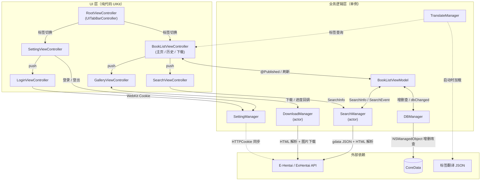

<p align="center">
  
</p>

<h1 align="center">EMHenTai</h1>

<p align="center"><strong>一个轻量级、纯 Swift 的 E-Hentai iOS 客户端。</strong></p>

<p align="center">
  <a href="https://github.com/yuman07/EMHentai/stargazers"></a>
  <a href="LICENSE"></a>
  <br>
  
  
  
</p>

<p align="center">
  <a href="README.md">English</a> | <a href="README_ZH.md">中文</a>
</p>

---

## 什么是 EMHenTai？

EMHenTai 是 [E-Hentai](https://e-hentai.org/) 的第三方 iOS 客户端，E-Hentai 是最大的在线画廊社区之一。项目完全使用 Swift 编写，不包含任何 Objective-C 代码，为 iPhone 和 iPad 用户提供原生的画廊浏览、搜索和下载体验。

应用无需后端服务器，直接与 E-Hentai 的 Web API 通信，通过解析 HTML 和 JSON 响应实现快速、支持离线阅读的使用体验。

## 功能特性

- **E-Hentai 与 ExHentai** — 无缝切换数据源；登录后可访问 ExHentai
- **高级搜索** — 按关键词、语言、评分和 10 种内容分类进行筛选
- **画廊阅读器** — 水平翻页式阅读，支持页码跳转和阅读进度记忆
- **下载管理** — 后台下载，支持暂停、继续和删除
- **浏览历史** — 自动记录浏览历史，支持一键清空
- **标签搜索** — 从任意画廊浏览和搜索相关标签
- **标签翻译** — 中英双语标签显示，数据来自 EhTagTranslation
- **内容过滤** — 可开关过滤 AI 生成和猎奇向内容
- **双重登录** — 支持账号密码登录（WebKit）和 Cookie 直接注入
- **存储管理** — 按类别查看磁盘占用，清理缓存数据
- **全面适配** — iPhone 与 iPad、横竖屏、暗黑模式、中英双语

## 截图预览

<p align="center">
  
  
  
</p>

<p align="center">
  
  
  
</p>

<p align="center">
  
  
</p>

## 安装

> 考虑到 E-Hentai 内容的法律风险，不直接提供 IPA 安装包。需要使用 Xcode 从源码构建。

### iOS (17.0+, arm64)

#### 前置条件

- 安装了 [Xcode](https://apps.apple.com/app/xcode/id497799835) 的 Mac（可从 Mac App Store 免费下载）
- Apple ID（免费即可，用于代码签名）
- 运行 iOS 17.0 或更高版本的 iPhone 或 iPad

#### 安装步骤

1. 克隆仓库并打开项目：
   ```bash
   git clone https://github.com/yuman07/EMHentai.git
   cd EMHentai
   open EMHenTai.xcodeproj
   ```
2. 在 Xcode 中选择 **EMHenTai** Target，进入 **Signing & Capabilities**，选择你的 Apple ID 团队。
3. 通过 USB（或 Wi-Fi）连接设备，并将其设为运行目标。
4. 按 **Cmd+R** 构建并安装。无需付费开发者账号。

#### 信任开发者证书

由于应用是侧载安装（非 App Store），首次启动前需要在设备上信任开发者证书：

1. 在设备上打开 **设置 > 通用 > VPN与设备管理**。
2. 点击「开发者 App」下方的你的开发者账号。
3. 点击 **信任** 并确认。

> **注意：** 免费 Apple ID 的描述文件有效期为 7 天，过期后需要重新连接设备并构建。付费 Apple Developer 账号（$99/年）可将有效期延长至一年。

## 使用指南

- **访问 ExHentai** — ExHentai 需要登录才能使用。进入 **设置** 标签页，点击登录状态栏，通过账号密码或 Cookie 登录。
- **长按画廊** — 弹出操作菜单，可选择下载、打开原网页或搜索相关标签。
- **页码跳转** — 在阅读器中，点击右上角的跳转图标，输入页码即可快速跳转。
- **全选/取消全选分类** — 在搜索页面，双击 **分类** 区域的标题栏可一键切换全部分类的选中状态。
- **内容过滤** — **设置** 标签页提供 AI 生成和猎奇向内容的过滤开关。

## 开发

> 仅支持在 macOS 上进行开发。

#### 前置条件

- macOS 26.2+（Tahoe）
- [Xcode 26.4+](https://apps.apple.com/app/xcode/id497799835)（可从 Mac App Store 免费下载）

#### 构建

```bash
# 克隆仓库
git clone https://github.com/yuman07/EMHentai.git

# 进入项目目录
cd EMHentai

# 打开 Xcode 项目
# SPM 依赖（Alamofire、Kingfisher）会在首次打开时自动解析
open EMHenTai.xcodeproj

# 在 Xcode 中按 Cmd+R 构建并运行到模拟器，或使用命令行：
xcodebuild -project EMHenTai.xcodeproj -scheme EMHenTai \
  -destination 'platform=iOS Simulator,name=iPhone 16' build
```

## 技术概览

EMHenTai 采用 **MVVM 架构**，配合一组**单例 Manager** 处理核心业务逻辑。UI 完全使用**纯代码 UIKit** 构建——没有 Storyboard 或 XIB——并使用 `UITableViewDiffableDataSource` 实现流畅的列表动画更新。

**并发模型** 基于 Swift 的 **Actor 机制**。`SearchManager` 和 `DownloadManager` 均声明为 `actor`，在编译期即可保证数据竞争安全，无需手动加锁。自定义 `@globalActor` 用于隔离搜索状态。图片下载通过 `TaskGroup` 并行执行，每个画廊按 40 张一组分批获取。

**响应式数据流** 由 **Combine** 驱动。Manager 层通过 `PassthroughSubject` 和 `CurrentValueSubject` 发布事件；ViewModel 通过 `sink` 订阅并以 `@Published` 属性驱动 UI。由此形成单向数据流：用户操作 → Manager 执行 → Combine 事件 → ViewModel 状态变更 → UI 刷新。

**网络层** 使用 **Alamofire** 并配置自动重试策略。画廊元数据通过 E-Hentai 的 `gdata` JSON 接口获取，页面级图片 URL 则通过轻量级 **HTML 字符串解析** 提取。**Kingfisher** 负责图片缓存，并共享 Cookie 会话以支持 ExHentai。

**持久化** 使用 **CoreData**，包含两个实体（`HistoryBook`、`DownloadBook`），共享相同的数据结构。`DBManager` 使用并发 `DispatchQueue` 配合 barrier 标志——读操作并发执行，写操作串行化——确保 Actor 体系外的线程安全。

**身份认证** 将 E-Hentai 会话 Cookie 存储在 `HTTPCookieStorage` 中，与 Alamofire 和 Kingfisher 会话共享。Cookie 变更通过 `NotificationCenter` 被监听，`SettingManager` 据此响应式更新登录状态 UI。

### 技术栈

| 类别 | 技术方案 |
|------|---------|
| 编程语言 | Swift 5 |
| 最低支持 | iOS 17.0 |
| UI 框架 | UIKit（纯代码） |
| 架构模式 | MVVM + 单例 Manager |
| 并发模型 | Swift Actors + async/await + GCD |
| 响应式 | Combine |
| 网络库 | Alamofire |
| 图片缓存 | Kingfisher |
| 持久化 | CoreData |
| 身份认证 | WebKit + HTTPCookieStorage |
| 国际化 | NSLocalizedString + JSON 标签数据库 |
| 包管理 | Swift Package Manager |

### 架构图



- **主数据流** — 用户浏览主页标签 → `BookListViewModel` 触发 `SearchManager` → Actor 隔离的搜索通过 Alamofire 请求 E-Hentai 的 `gdata` API → 解析后的 `Book` 结构体通过 Combine 的 `PassthroughSubject` 回传 → ViewModel 更新 `@Published books` → `DiffableDataSource` 动画刷新列表。
- **下载流水线** — 点击画廊推入 `GalleryViewController`，调用 `DownloadManager.download()`。Actor 将页面按每 40 张分组，通过 `TaskGroup` 并行请求每组的 HTML。通过字符串解析提取图片 URL 后并发下载，每张图片的下载进度通过 Combine 发布。下载完成的图片保存至 `Documents/<gid>/`。
- **认证边界** — `SettingManager` 管理 `HTTPCookieStorage`（与 Alamofire/Kingfisher 共享）和 `WKWebsiteDataStore`（登录 WebView 使用）中的 Cookie。Cookie 变更触发 `NotificationCenter` 事件，`SettingManager` 将其转换为 `CurrentValueSubject<Bool>` 登录状态，供设置页 UI 和搜索校验逻辑消费。
- **持久化层** — `DBManager` 维护内存中的 `[DBType: [Book]]` 缓存，与 CoreData `NSPersistentContainer` 后台上下文同步。并发 `DispatchQueue` 配合 `.barrier` 标志确保读写安全，不阻塞主线程。
- **标签翻译** — `TranslateManager` 在启动时加载内置的 JSON 数据库（来自 [EhTagTranslation](https://github.com/EhTagTranslation/Database)），构建英中双向查找字典，为全应用提供即时标签翻译。

### 项目结构

```
EMHenTai/
|-- EMHenTai/
|   |-- Source/
|   |   |-- AppDelegate.swift              # 应用入口，Kingfisher 与数据库初始化
|   |   |-- RootViewController.swift        # 四标签页 TabBar
|   |   |-- BookList/                       # 画廊列表（主页 / 历史 / 下载）
|   |   |-- Gallery/                        # 全屏水平翻页阅读器
|   |   |-- Search/                         # 高级搜索筛选 UI
|   |   |-- Setting/                        # 登录状态与存储管理
|   |   |-- Login/                          # 基于 WebKit 的 E-Hentai 登录
|   |   |-- Tag/                            # 相关标签浏览与翻译
|   |   |-- WebView/                        # 应用内浏览器（含分享功能）
|   |   |-- Manager/                        # 核心业务逻辑
|   |   |   |-- SearchManager.swift         # 画廊搜索（actor）
|   |   |   |-- DownloadManager.swift       # 并行图片下载（actor）
|   |   |   |-- DBManager.swift             # CoreData 持久化
|   |   |   |-- SettingManager.swift        # 认证、Cookie 与偏好设置
|   |   |   `-- TranslateManager.swift      # 标签中英互译
|   |   |-- Model/                          # Book、SearchInfo 数据结构
|   |   `-- Tools/                          # Swift 扩展与工具方法
|   `-- Support/
|       |-- Assets.xcassets/                # 应用图标与图片资源
|       |-- EMDB.xcdatamodeld/              # CoreData 数据模型
|       |-- Info.plist
|       |-- tag-*.json                      # 内置标签翻译数据库
|       |-- en.lproj/                       # 英文本地化字符串
|       `-- zh-Hans.lproj/                  # 中文本地化字符串
|-- EMHenTai.xcodeproj/                     # Xcode 项目（含 SPM 依赖）
|-- Screenshots/                            # 应用截图
`-- LICENSE                                 # MIT 许可证
```

## 常见问题

**Q：网页登录成功了，但 APP 中仍显示"未登录"？**

> E-Hentai 会对频繁登录的 IP 临时封禁。请切换 VPN 节点（推荐使用欧美 IP）后重新登录。

**Q：为什么下载有时会卡住？**

> 当 E-Hentai 检测到来自同一 IP 的大量页面请求时，会进行限速或封禁。请等待几分钟或切换网络后继续下载。

**Q：为什么没有 IPA 直接安装？**

> 考虑到 E-Hentai 内容的法律风险，不直接分发预编译安装包。从源码构建可确保用户知情选择。

## 致谢

- 部分 UI 设计参考了 [@Dai-Hentai](https://github.com/DaidoujiChen/Dai-Hentai)
- 标签翻译数据来自 [@EhTagTranslation](https://github.com/EhTagTranslation/Database)

## 许可证

本项目基于 [MIT License](LICENSE) 开源。
